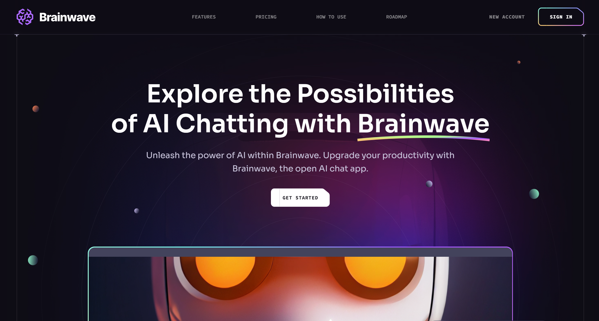

# Brainwave

[](https://brainwave-dv192.vercel.app/)

Welcome to Brainwave, a modern website showcasing stylish parallax effects, innovative bento box layouts, and responsive design. Brainwave is developed using ReactJS, Vite, HTML, CSS, and JavaScript. The project leverages the power of Framer Motion for animations and Tailwind CSS for styling. Get ready to explore the next generation of web experiences with Brainwave!

## Getting Started

To get a local copy of this project up and running, follow these steps:

### Prerequisites

Make sure you have Node.js installed.

### Installation

Clone the repository and install dependencies.

```bash
git clone https://github.com/DV192/brainwave.git
cd brainwave
npm install
```

### Usage

Start the development server.

```bash
npm run dev
```

Visit http://localhost:5173 in your browser.

## Project Inspiration

This project was created by following the tutorial on [JavaScript Mastery YouTube Channel](https://www.youtube.com/@javascriptmastery). Special thanks to the creator for the guidance and inspiration.

## Built With

- [React](https://react.dev/)
- [Vite](https://vitejs.dev/)
- HTML, CSS, JavaScript
- [Framer Motion](https://www.framer.com/motion/)
- [Tailwind CSS](https://tailwindcss.com/)

## Deployment

This project is deployed on [Vercel](https://vercel.com/). Visit the live version [here](https://brainwave-dv192.vercel.app/).
